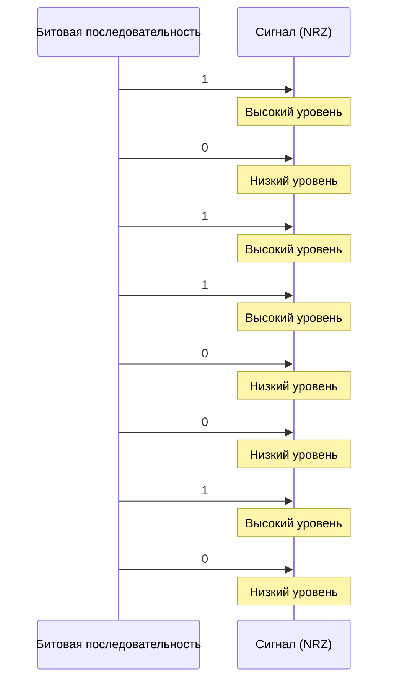

> [!info] Цель работы
> Изучить принципы кодирования сигналов на физическом уровне, освоить методы анализа помехоустойчивости и рассчитать пропускную способность канала связи для различных сред передачи.

> [!abstract] Оборудование и материалы
> - Персональный компьютер с установленным ПО для симуляции сетей (Cisco Packet Tracer или аналог).
> - Кабели: витая пара UTP Cat 5e, коаксиальный кабель RG-58.
> - Осциллограф (виртуальный или физический).
> - Методические указания.

## 1. Теоретическая часть

### 1.1. Что такое физический уровень?

Физический уровень (Physical Layer) — это **нижний уровень модели OSI**, который отвечает за передачу сырых битов по физической среде: кабелям, оптоволокну или радиоканалу. Его задача — преобразовать цифровые данные (0 и 1) в сигналы, которые могут распространяться по среде, и обратно.

Ключевые понятия:

| Понятие | Описание |
|---|---|
| **Бит** | Минимальная единица информации (0 или 1) |
| **Сигнал** | Физическое представление бита (напряжение, свет, радиоволна) |
| **Модуляция** | Процесс изменения параметров сигнала для кодирования данных |
| **Полоса пропускания** | Диапазон частот, который может передать канал |
| **Затухание** | Ослабление сигнала при прохождении по среде |

### 1.2. Формула пропускной способности

Согласно теореме Шеннона — Хартли, максимальная пропускная способность канала с шумом вычисляется как:

$$
C = B \cdot \log_2\left(1 + \frac{S}{N}\right)
$$

где:
- $C$ — пропускная способность (бит/с),
- $B$ — полоса пропускания канала (Гц),
- $S/N$ — отношение сигнал/шум (безразмерная величина).

> [!warning] Важно
> Эта формула даёт **теоретический предел**. Реальная скорость всегда ниже из-за накладных расходов протоколов, задержек и неидеальности оборудования.

### 1.3. Схема кодирования NRZ

На рисунке ниже показан пример кодирования битовой последовательности `10110010` методом **NRZ (Non-Return-to-Zero)**:

> [!tip] Как читать диаграмму
> Каждый такт соответствует одному биту. Высокий уровень — логическая «1», низкий — логический «0». Обратите внимание: при длинной последовательности одинаковых битов синхронизация может теряться — это главный недостаток NRZ.

## 2. Порядок выполнения работы

> [!todo] Задание 1. Расчёт пропускной способности
> 1. Задайте полосу пропускания канала $B = 1$ МГц.
> 2. Для отношений сигнал/шум $S/N = 10, 100, 1000$ рассчитайте пропускную способность $C$ по формуле Шеннона.
> 3. Заполните таблицу:

| $S/N$ | $\log_2(1 + S/N)$ | $C$, бит/с |
|---|---|---|
| 10 | ? | ? |
| 100 | ? | ? |
| 1000 | ? | ? |

> [!todo] Задание 2. Анализ кодирования
> 1. Закодируйте последовательность `11001010` методами NRZ и Manchester.
> 2. Нарисуйте временные диаграммы для каждого метода.
> 3. Сравните: какой метод лучше синхронизируется и почему?

> [!todo] Задание 3. Исследование затухания
> 4. Подключите витую пару длиной 100 м.
> 5. Подайте сигнал частотой 10 МГц.
> 6. Измерьте амплитуду на выходе. Повторите для длин 50 м и 200 м.
> 7. Постройте график зависимости затухания от длины.

## 3. Контрольные вопросы

1. Какие функции выполняет физический уровень модели OSI?
2. Чем отличается модуляция от кодирования?
3. Что такое полоса пропускания и как она связана с пропускной способностью?
4. Почему в витой паре используется скручивание проводников?
5. В чём преимущество оптоволокна перед медным кабелем на физическом уровне?

## 4. Требования к отчёту

> [!example] Отчёт должен содержать
> - [ ] Титульный лист с номером работы и ФИО.
> - [ ] Цель работы.
> - [ ] Расчётную часть (задание 1) с формулами и таблицей.
> - [ ] Временные диаграммы (задание 2), нарисованные от руки или в ПО.
> - [ ] График затухания (задание 3).
> - [ ] Ответы на контрольные вопросы.
> - [ ] Вывод по работе (3–5 предложений).

> [!bug] Частые ошибки
> - Забывают указать единицы измерения (Гц, бит/с, дБ).
> - При расчёте $\log_2$ путают натуральный и десятичный логарифм.
> - Рисуют диаграммы без привязки к тактовым интервалам.

---

*Лабораторная работа №1. Физический уровень. Версия 1.0*   *[TG](https://t.me/idobukhov)*
